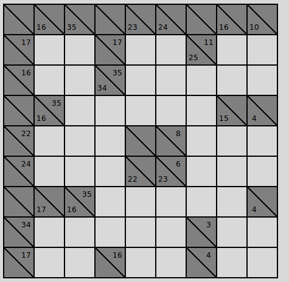
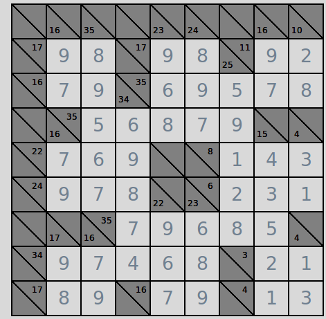
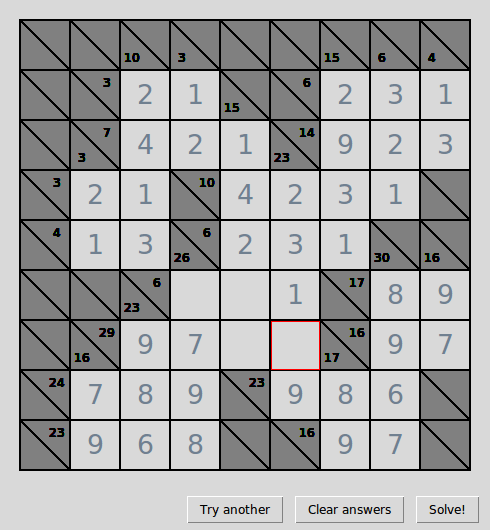
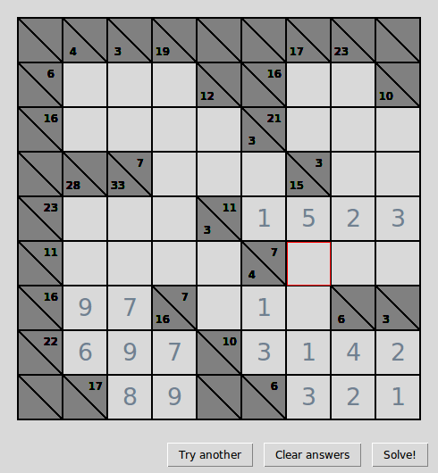
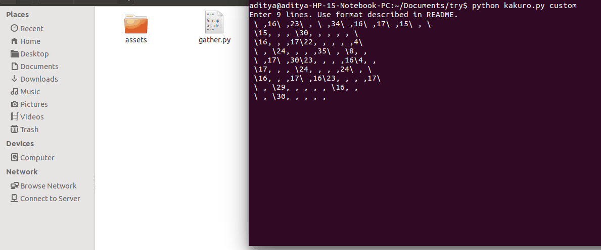
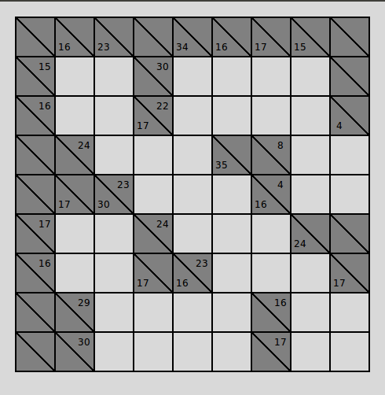

# Kakurosy

**Kakurosy** is an application for playing 9x9 **Kakuro** on. It comes with a web-scraper 
for gathering puzzles from the internet, a GUI screen for the user to solve the 
puzzle and an in-built solver. You can also use it as a solver as it allows custom puzzles to be loaded.
Kakurosy frames the Kakuro puzzle as an Integer Linear Program, 
which is solved using a solver.

## About Kakuro

### Rules
**Kakuro** or **Cross Sum** (Japanese: カックロ) is a fun, entertaining and highly 
addictive puzzle game that is often referred to as a mathematical transliteration 
of the crossword. It was more popular once than the now ubiquitous Sudoku, it is
extremely versatile because it can come in any size and the fillout space could 
assume arbitrary shapes and arguably it is more challenging. Find out more on [Wikipedia]. 
It has been proven to be [NP complete].

Kakuro is played on a rectangular grid of cells. The aim is to place numbers 
from 1 to 9 in blocks of empty cells running horizontally and vertically inside 
the larger grid. The sum of each block should match the target number, or clue, 
which appears inside darkened cells, divided into two by diagonal lines, at the 
top (for vertical problems) or to the left (for horizontal ones) of each empty block.
No number may be used more than once in each block.

In **Kakurosy**, the puzzles are played on a 9x9 grid

<div>
  
</div>

### Demo
Notice that duplicate entry is flagged off immediately. However you may choose to suppress 
and proceed.



You may clear the entries or view the solution in a jiffy using the eponymous buttons. 
Also, you can skip to the next puzzle with a promise of a new puzzle everytime in the current session.



In the `custom` (as opposed to `random`) mode, a puzzle may be entered from the console. Then you could try it out on the program and solve it.



### Custom Mode Specification
For entering any 9x9 Kakuro puzzle from the console, the following format is to be used:
* Every row of the puzzle is to be entered in a new line. Thus, there should be nine lines terminated by newlines.
* For a row, each cell entry must be delimited by commas. Thus there should be nine cells (and eight commas) a line.
* A blank cell for user input is to be represented by a space character. A darkened cell (with a diagonal partition)
  is to be represented by `x\y` where `x` denotes the entry in the lower-left triangular subcell and `y` denotes the 
  entry in the upper-right triangular subcell. `x` and `y` can be integers or space character.

Here is an example. The following input:
``` 
 \ ,16\ ,23\ , \ ,34\ ,16\ ,17\ ,15\ , \ 
 \15, , , \30, , , , , \ 
 \16, , ,17\22, , , , ,4\ 
 \ , \24, , , ,35\ , \8, , 
 \ ,17\ ,30\23, , , ,16\4, , 
 \17, , , \24, , , ,24\ , \ 
 \16, , ,17\ ,16\23, , , ,17\ 
 \ , \29, , , , , \16, , 
 \ , \30, , , , , \17, , 
```
represents the following puzzle:



### The Kakuro Integer Linear Program
In Kakuro, there is no objective function (in this case it is set to `0`), only constraints.
There are two constraints that must be passed on to the ILP solver. 
This determines the choice of integer variables. 

* **Sum Constraints:** Each block or zone **must sum up** to the specified number in the block 
  head. The horizontal blocks or zones have it to the left, the vertical ones on the top.

* **Distinctness Constraints:** Each block or zone **must have distinct** integers from `1 to 9` 
  in its cells. (The restriction to digits is enforced during entry itself.)

We use the variables `u_i_j_k` each a 0-1 integer variable which is 1 *iff* the cell entry in the cell 
in row `j` and column `k` is equal to `i` in the solution.

## Getting Started

### Prerequisites
**Kakurosy** is written in Python2. It also requires [GPLK], part of the GNU project, and [PuLP], a popular 
LP modeler written in python. It can generate MPS or LP files and call GLPK (also COIN CLP/CBC, CPLEX, and GUROBI) 
to solve linear problems.
GPLK can be installed in Linux from the package manager:

``` 
sudo apt-get install python-glpk
sudo apt-get install glpk-utils 
sudo apt-get install glpk-doc
sudo apt-get install libglpk-dev  
```
PuLP can be installed using pip:
```
sudo pip install pulp
sudo pulptest 
```
## Running the tests

The test puzzles are in the ```savedpuzzles.txt``` file.
To add more puzzles into this file (scrapes from [here]: So kindly read [this] and use 
accordingly. Please ensure web connection):
```
python gather.py
```
To use this puzzle bank and start a session with a randomly selected puzzle:
```
python kakuro.py random
```
To enter a custom puzzle in the console to be run in the application:
```
python kakuro.py custom
```

[NP complete]: http://www-imai.is.s.u-tokyo.ac.jp/~seta/paper/senior_thesis/seniorthesis.pdf
[Wikipedia]: https://en.wikipedia.org/wiki/Kakuro
[gif_try]:assets/demo_try.gif "Kakuro Try GIF"
[gif_oper]:assets/demo_oper.gif "Kakuro Operate GIF"
[gif_cust]:assets/demo_cust.gif "Kakuro Custom GIF"
[PuLP]: https://pythonhosted.org/PuLP/
[GPLK]: https://www.gnu.org/software/glpk/
[here]: http://www.kakuroconquest.com/
[this]: http://www.kakuroconquest.com/terms.php

## Author

I love **Kakuro** so this was a really fun project!


## License

This project is licensed under the MIT License - see the
[LICENSE.md](LICENSE) file for details
